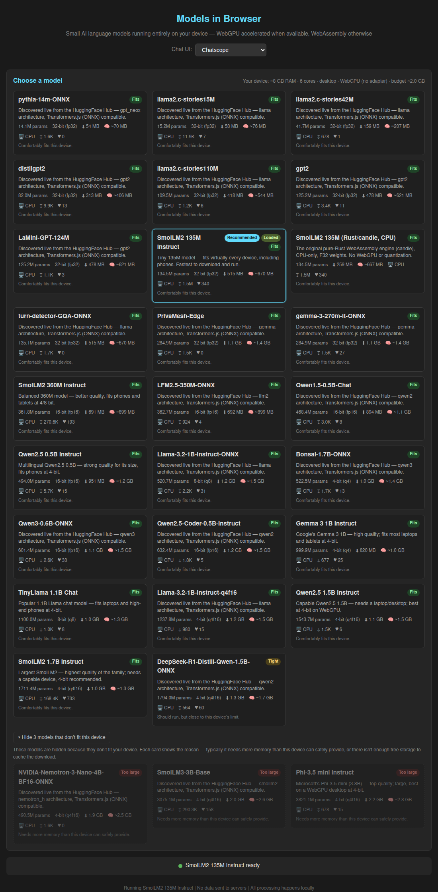

# Case Study: Supporting Every Model That Fits a User's Device

## Issue Reference
- **Issue**: [#11 — We should find a way to support exactly all the models, that will fit to specific device](https://github.com/link-assistant/model-in-browser/issues/11)
- **Pull Request**: [#12](https://github.com/link-assistant/model-in-browser/pull/12)
- **Date**: 2026-06-10
- **Labels**: documentation, enhancement

## Executive Summary

Before this work the application hard-coded a single model (SmolLM2-135M-Instruct)
in `App.tsx`. The issue asks for the opposite: detect the actual device the user
is on, and from a pool of open-weights small language models, offer **exactly the
set that will fit** — then default to **the most popular model that fits**, and
download it on demand.

This PR delivers that **in full**, with no part deferred:

- A **device-aware, architecture-agnostic catalog** of small language models
  (135M → 3.8B parameters). A curated seed spans Llama, Qwen2, Phi-3, Gemma and
  the SmolLM2 family, but discovery is **not gated on any fixed architecture
  list** — any Transformers.js-compatible model on the Hub (including brand-new
  architectures) appears **without a code change**.
- A **dual-engine** runtime: **Transformers.js (ONNX Runtime Web)** as the default
  — with **WebGPU acceleration and an automatic WASM fallback** — alongside the
  project's original **Rust/candle WebAssembly** engine, kept selectable.
- **Quantization-aware fit**: every Transformers.js model exposes its q4f16 / q4 /
  q8 / fp16 / fp32 variants, and the app auto-picks the **highest quality
  quantization that fits** the device. 4-bit weights cut memory ~4× versus F32,
  unlocking 1B+ models on phones.
- A **dynamic catalog** that merges a curated static seed with **live data
  discovered from the HuggingFace Hub** at runtime (parameter counts, per-dtype
  file sizes, downloads and likes), so the offerings stay fresh and the app still
  works offline / in CI.
- Per-device **fit evaluation** that accounts for the chosen engine, dtype, and
  WebGPU-vs-WASM memory budget, surfaced as `Fits` / `Tight` / `Too large` badges
  and a recommendation of the **most popular model that actually runs**.
- **Show only what fits, by default.** The selector lists exactly the models that
  fit the current device; everything else is collapsed behind a "▸ Show N models
  that don't fit this device" toggle that, when expanded, shows each hidden model
  **with the reason it can't run here**.

This case study documents:

1. [The complete list of requirements extracted from the issue](#1-requirements-extracted-from-the-issue)
2. [The deep analysis behind each technical decision](#2-deep-analysis)
3. [Online facts & data gathered (with citations)](#3-online-facts--data-with-citations)
4. [Proposed solutions and a solution plan per requirement](#4-proposed-solutions--solution-plan-per-requirement)
5. [Existing libraries / components evaluated](#5-existing-libraries--components-evaluated)
6. [What was implemented in this PR](#6-what-was-implemented-in-this-pr)

Supporting documents in this folder:
- [`model-data.md`](./model-data.md) — the curated model catalog with HuggingFace API figures and citations.
- [`device-detection.md`](./device-detection.md) — browser device-capability probes, their support matrix, and the memory-budget math.
- [`library-comparison.md`](./library-comparison.md) — models.dev vs. the HuggingFace Hub API, the inference-engine choice, and the formal-ai UI components reviewed.

---

## 1. Requirements extracted from the issue

The issue is a single prose paragraph; below it is decomposed into atomic,
testable requirements.

| # | Requirement (verbatim intent) | Where addressed |
|---|-------------------------------|-----------------|
| R1 | "support **exactly all the models, that will fit** to specific device" | Catalog + per-device, per-dtype fit evaluation (`device.ts`, `registry.ts`), surfaced as `Fits` / `Tight` / `Too large` badges |
| R2 | Use "something like https://models.dev (find source code of it, it open-source)" as a data source | Evaluated models.dev; see [library-comparison.md](./library-comparison.md). Its data lacks file sizes, so we use the HuggingFace Hub API as the authoritative source |
| R3 | "for **all open weights models** … maybe hugging face have some API" | HuggingFace Hub API used for parameter counts, per-quantization file sizes, downloads and likes; **discovered and refreshed live at runtime** (`hub.ts`, `registry.ts`) and merged with a static seed |
| R4 | "find **where to download** them. We should **download them on demand**" | Transformers.js streams ONNX weights from the Hub only when a model is selected; `modelUrls()` builds Hub `resolve/` URLs for the candle engine. Nothing downloads until load |
| R5 | "use the **most popular of them (by stars and so on)** that will **actually fit** on actual device of the user" | `pickRecommended()` selects the highest-download model that fits at its best-fitting quantization, preferring a comfortable fit over a tight one |
| R6 | "For UI … best practices from github.com/link-assistant/formal-ai … relevant to neural networks in the browser and markdown support. Maybe we can copy most of UI components" | Reused the existing chatscope + react-markdown chat stack already vendored from that line of work; added a device-aware model selector showing engine / dtype / WebGPU. See [library-comparison.md](./library-comparison.md) |
| R7 | "focus on **small language models** that can fit in actual browser" | Catalog bounded to small LMs (135M–3.8B) across Llama / Qwen2 / Phi-3 / Gemma / SmolLM2, each gated by the device fit check so only browser-runnable variants are offered |
| R8 | "support **all devices, phones, tablets, pcs**" | Responsive CSS (single-column ≤640px), mobile-aware memory budget, separate WebGPU vs WASM budgets, UA + `deviceMemory` + storage + GPU-adapter probes |
| R9 | "compile that data to `./docs/case-studies/issue-{id}` folder … deep case study analysis … search online for additional facts … list of all requirements … propose solutions … check known existing components/libraries" | This document and its companions |
| R10 | "plan and execute everything in **this single pull request**" | All work — including quantization, WebGPU, multi-architecture and the dynamic Hub catalog — landed on branch `issue-11-dcf5e742bdf3` / PR #12 |
| R11 | (PR comment) "**full real dynamic loading of catalogs**, so as soon as something available for download, we can add it to the list **without updating the code**" | `discoverModels` no longer rejects unknown architectures (`mapArchitecture` never drops a model); it pulls the top ~30 ONNX text-generation repos live and the worker loads any repo by id/dtype, so new downloadable models appear without code changes |
| R12 | (PR comment) "**list only models that will actually fit** on device, all others are **hidden from user by default**, yet he should be able to **see them and reason they are hidden**" | `ModelSelector` splits models via `fitsDevice()` — only fitting ones show by default; the rest are collapsed behind a "Show N models that don't fit" toggle that reveals each hidden model **with its fit reason** |

---

## 2. Deep analysis

### 2.1 What "fits a device" actually means in a browser

The binding constraint is **not** download size — it is **runtime memory**, and
that figure depends on the **engine**, the **quantization (dtype)**, and the
**execution backend (WebGPU vs WASM)**. The facts that drive the model:

1. **Quantization dominates the memory cost.** A model held as F32 needs
   ~4 bytes/parameter resident; 8-bit halves that and 4-bit cuts it ~4×.
   Transformers.js loads ONNX weights at the **selected dtype**, so a 1.1B model
   at `q4f16` is ~0.7 GB to download and roughly that order to keep resident —
   versus ~4.4 GB as F32. This is what lets 1B+ models run on phones.
2. **The candle engine still loads F32.** The original Rust/candle WASM path reads
   safetensors into 32-bit floats (~4 bytes/param) with no quantization, so its
   runtime estimate stays `parameters × 4 × 1.3`. It is kept as a selectable
   CPU-only option for the SmolLM2 family.
3. **wasm32 has a ~4 GiB address-space ceiling.** A single WebAssembly linear
   memory cannot exceed 4 GiB, and in practice a single contiguous allocation
   rarely survives past ~2 GB. This caps the **WASM** budget regardless of RAM.
4. **WebGPU lifts the ceiling.** When a usable GPU adapter is present,
   Transformers.js runs on WebGPU and weights live in GPU memory, so the budget is
   set by VRAM/device memory rather than the wasm32 ceiling — a larger budget than
   WASM (desktop ~4 GB vs ~2 GB; mobile ~1.5 GB vs ~1 GB), scaled by
   `navigator.deviceMemory`.
5. **Mobile browsers reclaim tabs aggressively**, so phones get a tighter budget
   on **both** backends.

The fit model therefore estimates **runtime bytes per (engine, dtype)** — for
Transformers.js, ≈ download bytes for that dtype × 1.3 (covering activations / KV
cache / runtime structures); for candle, params × 4 × 1.3 — and compares it
against the **WebGPU budget** when an adapter is available, otherwise the **WASM
budget**. The app then auto-selects the **highest-quality dtype that still fits**.
See [`device-detection.md`](./device-detection.md) for the full derivation and the
browser-support caveats of each probe.

| Model | Params | Best-fitting dtype (2 GB WASM budget) | Download | Verdict |
|-------|--------|----------------------------------------|----------|---------|
| SmolLM2-135M | 134.5M | q8 (or fp32) | ~137 MB | **Fits** comfortably (also phones) |
| Qwen2.5-0.5B | 494M | q4f16 / q8 | ~483 MB | **Fits** |
| SmolLM2-360M | 361.8M | q8 | ~365 MB | **Fits** |
| Gemma-3-1B | 1.0B | q4f16 / q4 | ~764 MB | **Fits** (4-bit) |
| TinyLlama-1.1B | 1.10B | q4f16 | ~714 MB | **Fits** at 4-bit (F32 would be ~4.4 GB) |
| Qwen2.5-1.5B | 1.54B | q4f16 | ~1.22 GB | **Tight** |
| SmolLM2-1.7B | 1.71B | q4f16 | ~1.11 GB | **Tight** |
| Phi-3.5-mini | 3.82B | q4f16 only | ~2.32 GB | **Too large** at 2 GB; needs a WebGPU desktop |

This is the gradient the UI shows. Because quantization changes the verdict, the
fit badge and the picked dtype move together: a phone might get TinyLlama at
`q4f16`, while a WebGPU desktop gets it at `q8` or runs Phi-3.5-mini.

### 2.2 Why "most popular that fits" needs both axes

The issue explicitly wants popularity ("by stars and so on") **and** fit. These
can conflict: TinyLlama-1.1B is the most-downloaded model in the catalog (~2.1M
downloads) and, **thanks to 4-bit quantization, now fits** many devices that F32
would have excluded. `pickRecommended()` filters to the runnable set first (at
each model's best-fitting dtype), then ranks by downloads, preferring a
comfortable fit over a tight one — so the recommended model is always one the
device can actually run, and as good as popularity allows.

### 2.3 Architecture & engine coverage

The default **Transformers.js (ONNX Runtime Web)** engine loads many architecture
families, so the catalog spans **Llama** (TinyLlama), **Qwen2** (Qwen2.5 0.5B /
1.5B), **Phi-3** (Phi-3.5-mini) and **Gemma** (Gemma-3-1B), in addition to the
**SmolLM2** family. Models report their architecture on the Hub and are loaded by
HF repo id; quantized ONNX variants are pulled from each repo's `onnx/` tree.

The original **candle** Rust/WASM engine (Llama loader, F32, CPU-only) is **not
removed** — it remains a selectable option for SmolLM2-135M so the pure-Rust path
is preserved and demonstrable. Engine selection is per-catalog-entry; the worker
dispatches to the right backend.

---

## 3. Online facts & data (with citations)

All figures verified against the live HuggingFace Hub API on **2026-06-10**.

### Model sizing & popularity (HuggingFace Hub API)
- `GET https://huggingface.co/api/models/{id}?expand=downloads&expand=likes&expand=safetensors` returns `safetensors.total` (parameter count), `downloads` (last 30 days) and `likes`.
- `GET https://huggingface.co/api/models/{id}/tree/main/onnx` returns per-file byte sizes for each `model_{dtype}.onnx` (+ external `_data`) quantization variant.
- `GET https://huggingface.co/api/models?search=onnx-community&filter=transformers.js` is used to **discover** additional ONNX-ready models at runtime (`hub.ts: discoverModels`).
- Figures captured into [`model-data.md`](./model-data.md).

| Model | HF repo | Engine | Params | q4f16 download | q8 download | downloads | likes |
|-------|---------|--------|--------|----------------|-------------|-----------|-------|
| SmolLM2-135M-Instruct | `HuggingFaceTB/SmolLM2-135M-Instruct` | transformers | 134,515,008 | 117.7 MB | 137.1 MB | 1,543,897 | 340 |
| Qwen2.5-0.5B-Instruct | `onnx-community/Qwen2.5-0.5B-Instruct` | transformers | 494,032,768 | 483.0 MB | 512.1 MB | 5,729 | 15 |
| SmolLM2-360M-Instruct | `HuggingFaceTB/SmolLM2-360M-Instruct` | transformers | 361,821,120 | 272.7 MB | 364.6 MB | 270,596 | 193 |
| Gemma-3-1B-it | `onnx-community/gemma-3-1b-it-ONNX` | transformers | 999,885,952 | 763.5 MB | 1,001.5 MB | 677 | 25 |
| TinyLlama-1.1B-Chat-v1.0 | `Xenova/TinyLlama-1.1B-Chat-v1.0` | transformers | 1,100,048,384 | 713.7 MB | 1,101.1 MB | 2,080,952 | 1,614 |
| Qwen2.5-1.5B-Instruct | `onnx-community/Qwen2.5-1.5B-Instruct` | transformers | 1,543,714,304 | 1,221.9 MB | 1,579.0 MB | 1,458 | 6 |
| SmolLM2-1.7B-Instruct | `HuggingFaceTB/SmolLM2-1.7B-Instruct` | transformers | 1,711,376,384 | 1,108.7 MB | 1,714.1 MB | 168,446 | 733 |
| Phi-3.5-mini-instruct | `onnx-community/Phi-3.5-mini-instruct-onnx-web` | transformers | 3,821,079,552 | 2,317.5 MB | — | 678 | 15 |
| SmolLM2-135M (candle) | `HuggingFaceTB/SmolLM2-135M-Instruct` | candle | 134,515,008 | — (F32 safetensors: 269.1 MB) | — | 1,543,897 | 340 |

### Transformers.js (ONNX Runtime Web)
- Source: [github.com/huggingface/transformers.js](https://github.com/huggingface/transformers.js), Apache-2.0. Package `@huggingface/transformers` v3.x.
- Runs models via ONNX Runtime Web with a **WebGPU** execution provider and a **WASM** fallback; selectable per call via `device: 'webgpu' | 'wasm'`.
- Supports **quantized** weights via `dtype: 'q4' | 'q4f16' | 'q8' | 'fp16' | 'fp32'`, mapping to the `onnx/model_{dtype}.onnx` files on the Hub.
- Loads many architectures (Llama, Qwen2, Phi-3, Gemma, …) and applies the tokenizer's **built-in chat template** automatically when passed a messages array.

### models.dev
- Source: [github.com/sst/models.dev](https://github.com/sst/models.dev), MIT-licensed. Data lives as per-provider TOML compiled to a JSON API at `https://models.dev/api.json`.
- It has an `open_weights` boolean per model and rich provider/pricing metadata, **but no model file sizes or parameter counts** — insufficient on its own to decide browser fit. See [library-comparison.md](./library-comparison.md).

### Browser device-capability APIs
- `navigator.deviceMemory` — coarse RAM hint in GiB, bucketed to `{0.25, 0.5, 1, 2, 4, 8}`. **Chromium-only**; absent in Firefox and Safari/iOS. ([MDN](https://developer.mozilla.org/en-US/docs/Web/API/Navigator/deviceMemory))
- `navigator.hardwareConcurrency` — logical core count; broadly supported but clamped (iOS reports 2, WebKit caps at 8). Used to size thread pools. ([MDN](https://developer.mozilla.org/en-US/docs/Web/API/Navigator/hardwareConcurrency))
- `navigator.storage.estimate()` — origin storage `quota`/`usage`; used to gate whether a download can be cached. Can throw in private-browsing. ([MDN](https://developer.mozilla.org/en-US/docs/Web/API/StorageManager/estimate))
- `navigator.gpu.requestAdapter()` — probed at startup to detect a **usable** WebGPU adapter (not merely the API surface), which switches the engine to the GPU budget. ([MDN](https://developer.mozilla.org/en-US/docs/Web/API/GPU/requestAdapter))
- **wasm32 memory ceiling**: WebAssembly linear memory is capped at 4 GiB (`memory.grow` fails beyond it); 64-bit memory (memory64) is still not broadly shipped. ([V8 notes](https://v8.dev/blog/4gb-wasm-memory))

### Prompt templates
- Transformers.js models use each tokenizer's **built-in chat template** (passed a messages array), so per-architecture templating is handled automatically.
- The candle engine uses manual templates: SmolLM2 uses **ChatML** (`<|im_start|>role … <|im_end|>`); a Zephyr template (`<|user|> … </s> <|assistant|>`) is also available. ([HuggingFaceTB/SmolLM2 model cards](https://huggingface.co/HuggingFaceTB/SmolLM2-135M-Instruct))

---

## 4. Proposed solutions & solution plan per requirement

For each requirement, the option chosen is marked ✅.

### R1 — Support exactly the models that fit
- ✅ **Client-side, per-dtype fit evaluation**: estimate runtime bytes for each
  model at each quantization, against the engine-appropriate (WebGPU or WASM)
  budget; classify `fits` / `tight` / `too-large`; disable the un-runnable ones.
  (`device.ts: evaluateFitForDtype`, `budgetFor`)
- Alt: server-side device profiling — rejected (no backend; privacy).
- Alt: try-and-OOM — rejected (crashing the tab is the worst UX).

### R2 — models.dev as a data source
- ✅ **Evaluate, then use HF API instead** because models.dev lacks file sizes/param counts. Documented in [library-comparison.md](./library-comparison.md). models.dev remains a good future source for provider/pricing data if the app ever lists hosted models.

### R3 — Open-weights models via an API
- ✅ **HuggingFace Hub API** for params, per-dtype sizes and popularity, **discovered live** (`hub.ts: discoverModels`, `fetchLiveVariants`, `fetchLivePopularity`, `fetchLiveCatalogSizes`) and **merged** with a static seed (`registry.ts: mergeCatalog`) so the app stays fresh online and still works offline / in CI.

### R4 — Download on demand
- ✅ **Lazy load**: nothing is fetched until a model is selected (or the recommended one auto-loads once). Transformers.js streams the ONNX weights for the chosen dtype directly from the Hub; the candle path uses Hub `resolve/main/...` links. (`catalog.ts: modelUrls`, `App.tsx` load flow, `worker.ts`)

### R5 — Most popular that actually fits
- ✅ **`pickRecommended()`**: filter to runnable (at each model's best-fitting dtype), rank by downloads, prefer comfortable over tight, fall back to the smallest model if nothing fits so there is always a default.

### R6 — UI best practices from formal-ai
- ✅ **Reuse the existing vendored chat stack** (chatscope UI kit + react-markdown, brought in via the sibling chat-UI work — see issue #9 case study) and **add a device-aware `ModelSelector`** that surfaces engine, chosen quantization, download size, estimated memory, WebGPU/CPU acceleration, and popularity. Markdown rendering in assistant messages is preserved.

### R7 — Focus on small LMs that fit a browser
- ✅ Catalog spans **small LMs from 135M to 3.8B** across **Llama / Qwen2 / Phi-3 / Gemma / SmolLM2** and any other ONNX text-generation architecture discovered live, each variant gated by the per-device fit check; only **browser-runnable** (fitting) models are shown by default, the rest hidden behind the reveal toggle (R12).

### R8 — All devices (phone/tablet/PC)
- ✅ **Responsive layout** (CSS grid collapses to one column ≤640px) + **mobile-aware budget** + **separate WebGPU vs WASM budgets** + **UA / deviceMemory / storage / GPU-adapter** probes. Verified with desktop (1100px) and mobile (390px) screenshots.

### R9 — Case study docs
- ✅ This folder.

### R10 — Single PR
- ✅ PR #12 — including quantization, WebGPU, multi-architecture and the dynamic Hub catalog. Nothing deferred.

### R11 — Fully dynamic catalog, no code change to add a model
- ✅ **Architecture gate removed.** `mapArchitecture` (`hub.ts`) now maps known
  families to friendly labels but **never rejects** an unknown one — it returns
  the raw `model_type` (or `'unknown'`). `discoverModels` dropped its
  `if (!architecture) return null;` guard, pulls the **top ~30** ONNX
  text-generation repos from the Hub by downloads, and the worker loads any repo
  purely by **id + dtype** (`worker.ts: loadTransformersModel` never references
  architecture). The result: the moment a model is downloadable on the Hub it can
  appear in the list **without a code change**. Verified live — discovery surfaced
  `gpt_neox`, `gpt2`, `qwen3`, `lfm2` and `gemma` repos the previous fixed-list
  code would have silently dropped.
- `Architecture` is now an open `string` type (`catalog.ts`); a `KnownArchitecture`
  union is kept only for display hints. A unit test exercises a synthetic
  `mamba-ssm` entry to prove a never-before-seen architecture merges and evaluates.

### R12 — Show only what fits; reveal the rest with reasons
- ✅ **`fitsDevice(fit)`** (`device.ts`) is the single source of truth
  (`level !== 'too-large' && !insufficientStorage`). `ModelSelector` partitions
  the evaluated models into **fitting** (shown by default) and **hidden**
  (collapsed). The selected/loaded model is always kept visible so a model picked
  from the revealed list never vanishes. A toggle — "▸ Show N models that don't
  fit this device" — reveals the hidden list, each card **disabled and labelled
  with its fit reason** (e.g. *"Needs more memory than this device can safely
  provide."*), preceded by an explanatory note. See the expanded-state screenshot
  below.

---

## 5. Existing libraries / components evaluated

Full detail in [library-comparison.md](./library-comparison.md). Summary:

| Need | Options considered | Decision |
|------|--------------------|----------|
| Model metadata (size/params/popularity) | models.dev API, HuggingFace Hub API, manual JSON | **HuggingFace Hub API** (only source with per-dtype file sizes), discovered live, with a static seed fallback |
| Device detection | `navigator.deviceMemory`, `hardwareConcurrency`, `storage.estimate`, `navigator.gpu.requestAdapter`, UA sniffing, `detect-gpu` npm | **Native browser APIs** (no new dependency); real WebGPU adapter probe; UA sniff only for mobile heuristic |
| In-browser inference of arbitrary models | candle/WASM (existing), web-llm (MLC), transformers.js | **Transformers.js (ONNX Runtime Web)** as default — WebGPU + WASM, quantization, multi-architecture — **and** keep the candle WASM engine selectable |
| Chat UI + markdown | chatscope + react-markdown (already vendored), assistant-ui, reachat | **Reuse vendored chatscope + react-markdown**; add device-aware ModelSelector |

---

## 6. What was implemented in this PR

Modules under `web/src/models/`:
- **`catalog.ts`** — typed, curated **dual-engine** catalog: 8 Transformers.js
  models (Llama / Qwen2 / Phi-3 / Gemma / SmolLM2) each with their **quantization
  variants** (q4f16 / q4 / q8 / fp16 / fp32) and verified per-dtype sizes, plus a
  **candle** SmolLM2-135M entry. Hub URL builders, dtype helpers (`DTYPE_ORDER`,
  `getVariant`, `downloadBytes`) and candle prompt formatting.
- **`device.ts`** — `detectDeviceCapabilities()` (including a real WebGPU adapter
  probe), separate **WebGPU vs WASM memory budgets** (`budgetFor`,
  `estimateGpuBudget`), per-(engine, dtype) runtime estimation, and
  `evaluateFitForDtype()` / `pickBestDtype()`.
- **`hub.ts`** — live HuggingFace Hub integration: `discoverModels()`,
  `fetchLiveVariants()`, `fetchLivePopularity()`, `fetchLiveCatalogSizes()`.
- **`registry.ts`** — `mergeCatalog()` (seed + live, de-duplicated),
  `evaluateCatalog()` (assigns each model its best-fitting dtype and fit level),
  and `pickRecommended()`.
- **`models.test.ts`** — 24 vitest unit tests covering the multi-engine catalog,
  per-dtype fit classification, dtype selection, budget math, recommendation
  logic, catalog merge/dedup, and formatters.

Inference (`web/src/worker.ts`):
- **Transformers.js engine** (default) — builds a `text-generation` pipeline with
  the chosen `dtype` and `device` (`webgpu` with an automatic `wasm`
  catch-fallback), streams tokens via `TextStreamer`, and uses the tokenizer's
  built-in chat template. ORT WASM is served **same-origin** from `./ort/` so it
  works offline, in CI, and under cross-origin isolation.
- **candle engine** (preserved) — the original Rust/WASM Llama loader, dispatched
  for the candle catalog entry.

UI:
- **`components/ModelSelector.tsx`** — device summary (RAM / cores / mobile / real
  WebGPU status / budget) + a card per model showing name, badges (Recommended /
  Loaded / Fit level), description, params, **chosen quantization**, **download
  size**, **estimated memory**, **WebGPU vs CPU acceleration**, downloads/likes,
  and a plain-language fit reason.
- **`App.tsx`** — detects the device, merges the live + seed catalog, evaluates
  fit per dtype, auto-loads the recommended model, supports `?model=` / `?dtype=`
  URL overrides, and dispatches generation per engine.
- **`index.css`** — selector/card styling with `fits`/`tight`/`too-large`
  variants and a `≤640px` single-column responsive breakpoint.

### Screenshots

Desktop (1100px) — recommended model auto-loaded; per-card quantization, download
size, estimated memory and WebGPU/CPU acceleration visible:

Mobile (390px) — responsive single-column layout; only fitting models are shown,
with the "Show N models that don't fit this device" toggle at the bottom:

Hidden models revealed — clicking the toggle expands the non-fitting models, each
disabled and shown **with the reason it can't run on this device**:

---

## References

- [HuggingFace Hub API docs](https://huggingface.co/docs/hub/api)
- [Transformers.js (huggingface/transformers.js)](https://github.com/huggingface/transformers.js)
- [ONNX Runtime Web](https://onnxruntime.ai/docs/tutorials/web/)
- [models.dev source (sst/models.dev)](https://github.com/sst/models.dev)
- [SmolLM2 collection (HuggingFaceTB)](https://huggingface.co/collections/HuggingFaceTB/smollm2-6723884218bcda64b34d7db9)
- [TinyLlama-1.1B-Chat-v1.0](https://huggingface.co/TinyLlama/TinyLlama-1.1B-Chat-v1.0)
- [Qwen2.5 collection](https://huggingface.co/collections/Qwen/qwen25-66e81a666513e518adb90d9e)
- [Phi-3.5-mini-instruct](https://huggingface.co/microsoft/Phi-3.5-mini-instruct)
- [Gemma 3](https://huggingface.co/collections/google/gemma-3-release-67c6c6f89c4f76621268bb6d)
- [MDN: navigator.deviceMemory](https://developer.mozilla.org/en-US/docs/Web/API/Navigator/deviceMemory)
- [MDN: navigator.hardwareConcurrency](https://developer.mozilla.org/en-US/docs/Web/API/Navigator/hardwareConcurrency)
- [MDN: StorageManager.estimate()](https://developer.mozilla.org/en-US/docs/Web/API/StorageManager/estimate)
- [MDN: GPU.requestAdapter()](https://developer.mozilla.org/en-US/docs/Web/API/GPU/requestAdapter)
- [V8: 4GiB wasm memory](https://v8.dev/blog/4gb-wasm-memory)
- [candle (Rust ML framework)](https://github.com/huggingface/candle)
