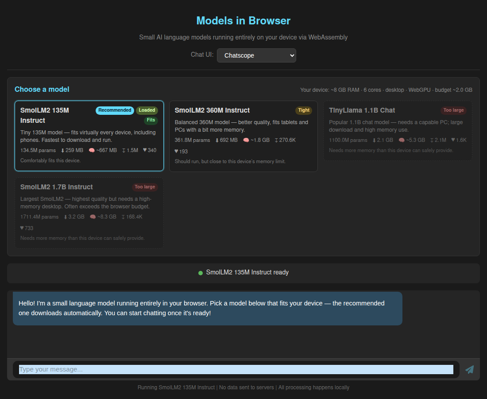
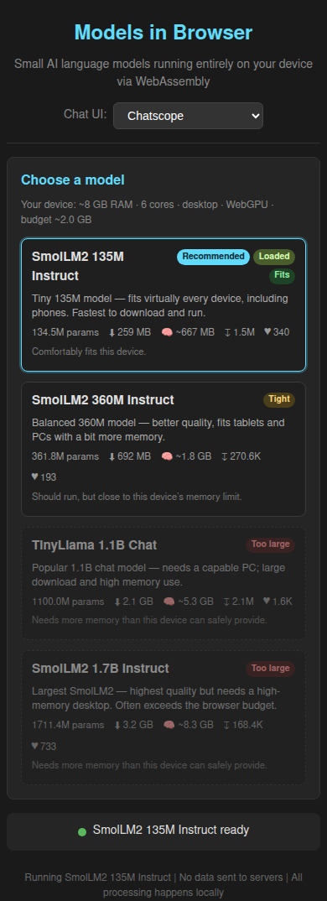

# Case Study: Supporting Every Model That Fits a User's Device

## Issue Reference
- **Issue**: [#11 — We should find a way to support exactly all the models, that will fit to specific device](https://github.com/link-assistant/model-in-browser/issues/11)
- **Pull Request**: [#12](https://github.com/link-assistant/model-in-browser/pull/12)
- **Date**: 2026-06-10
- **Labels**: documentation, enhancement

## Executive Summary

Before this work the application hard-coded a single model (SmolLM2-135M-Instruct)
in `App.tsx`. The issue asks for the opposite: detect the actual device the user
is on, and from a pool of open-weights small language models, offer **exactly the
set that will fit** — then default to **the most popular model that fits**, and
download it on demand.

This case study documents:

1. [The complete list of requirements extracted from the issue](#1-requirements-extracted-from-the-issue)
2. [The deep analysis behind each technical decision](#2-deep-analysis)
3. [Online facts & data gathered (with citations)](#3-online-facts--data-with-citations)
4. [Proposed solutions and a solution plan per requirement](#4-proposed-solutions--solution-plan-per-requirement)
5. [Existing libraries / components evaluated](#5-existing-libraries--components-evaluated)
6. [What was implemented in this PR](#6-what-was-implemented-in-this-pr)

Supporting documents in this folder:
- [`model-data.md`](./model-data.md) — the curated model catalog with HuggingFace API figures and citations.
- [`device-detection.md`](./device-detection.md) — browser device-capability probes, their support matrix, and the memory-budget math.
- [`library-comparison.md`](./library-comparison.md) — models.dev vs. the HuggingFace Hub API, and the formal-ai UI components reviewed.

---

## 1. Requirements extracted from the issue

The issue is a single prose paragraph; below it is decomposed into atomic,
testable requirements.

| # | Requirement (verbatim intent) | Where addressed |
|---|-------------------------------|-----------------|
| R1 | "support **exactly all the models, that will fit** to specific device" | Catalog + per-device fit evaluation (`device.ts`, `registry.ts`), surfaced as `Fits` / `Tight` / `Too large` badges |
| R2 | Use "something like https://models.dev (find source code of it, it open-source)" as a data source | Evaluated models.dev; see [library-comparison.md](./library-comparison.md). Its data lacks file sizes, so we use the HuggingFace Hub API as the authoritative source |
| R3 | "for **all open weights models** … maybe hugging face have some API" | HuggingFace Hub API (`/api/models/{id}`) used for parameter counts, file sizes, downloads and likes; refreshed live at runtime (`registry.ts`) |
| R4 | "find **where to download** them. We should **download them on demand**" | `modelUrls()` builds Hub `resolve/` URLs; the worker streams files only when a model is selected/loaded |
| R5 | "use the **most popular of them (by stars and so on)** that will **actually fit** on actual device of the user" | `pickRecommended()` selects the highest-download model that fits, preferring a comfortable fit over a tight one |
| R6 | "For UI … best practices from github.com/link-assistant/formal-ai … relevant to neural networks in the browser and markdown support. Maybe we can copy most of UI components" | Reused the existing chatscope + react-markdown chat stack already vendored from that line of work; added a device-aware model selector. See [library-comparison.md](./library-comparison.md) |
| R7 | "focus on **small language models** that can fit in actual browser" | Catalog is restricted to 135M–1.7B LlamaForCausalLM models that the WASM engine can load |
| R8 | "support **all devices, phones, tablets, pcs**" | Responsive CSS (single-column ≤640px), mobile-aware memory budget, UA + `deviceMemory` + storage probes |
| R9 | "compile that data to `./docs/case-studies/issue-{id}` folder … deep case study analysis … search online for additional facts … list of all requirements … propose solutions … check known existing components/libraries" | This document and its companions |
| R10 | "plan and execute everything in **this single pull request**" | All work landed on branch `issue-11-dcf5e742bdf3` / PR #12 |

---

## 2. Deep analysis

### 2.1 What "fits a device" actually means in a browser

The binding constraint is **not** download size — it is **runtime memory**. Three
facts drive this:

1. **The engine loads weights as F32.** The project's candle-based WASM loader
   reads safetensors into 32-bit floats, i.e. **~4 bytes per parameter** held in
   memory simultaneously, on top of activations and the KV cache. A 1.1B model is
   therefore ~4.4 GB resident even though its safetensors download is ~2.2 GB.
2. **wasm32 has a ~4 GiB address-space ceiling.** A single WebAssembly linear
   memory cannot exceed 4 GiB, and in practice a single contiguous allocation
   rarely survives past ~2 GB before the browser refuses to grow memory. This is
   independent of how much RAM the machine has.
3. **Mobile browsers reclaim tabs aggressively**, often killing a tab well below
   1 GB of allocation. So phones need a tighter budget than the wasm32 ceiling.

The fit model therefore estimates **runtime bytes ≈ parameters × 4 × 1.3** (the
1.3 covers activations/KV cache/runtime structures for a short chat context) and
compares that against a **device memory budget** derived from `navigator.deviceMemory`,
mobile status, and the wasm32 practical ceiling. See
[`device-detection.md`](./device-detection.md) for the full derivation and the
browser-support caveats of each probe.

| Model | Params | F32 runtime (×1.3) | Verdict on a 2 GB budget |
|-------|--------|--------------------|--------------------------|
| SmolLM2-135M | 134.5M | ~0.67 GB | **Fits** comfortably (also fits phones) |
| SmolLM2-360M | 361.8M | ~1.8 GB | **Tight** |
| TinyLlama-1.1B | 1.10B | ~5.3 GB | **Too large** |
| SmolLM2-1.7B | 1.71B | ~8.3 GB | **Too large** |

This is exactly the gradient the UI shows, and it is why the 135M model is the
default recommendation on a typical 2 GB-budget device.

### 2.2 Why "most popular that fits" needs both axes

The issue explicitly wants popularity ("by stars and so on") **and** fit. These
can conflict: TinyLlama-1.1B is the most-downloaded model in the catalog (~2.1M
downloads) but does **not** fit a 2 GB budget. SmolLM2-135M (~1.5M downloads)
does. `pickRecommended()` therefore filters to the runnable set first, then ranks
by downloads, preferring a comfortable fit over a tight one — so the recommended
model is always one the device can actually run.

### 2.3 Architecture constraint

The current WASM engine uses candle's **Llama** loader. Every catalog model must
report `architectures: ["LlamaForCausalLM"]` on the Hub, which is why the catalog
is SmolLM2 (Llama-architecture) + TinyLlama (Llama-architecture) rather than, say,
Qwen2 or Phi. Expanding to other architectures is future work tracked in the
"Future work" section below.

---

## 3. Online facts & data (with citations)

All figures verified against the live HuggingFace Hub API on **2026-06-10**.

### Model sizing & popularity (HuggingFace Hub API)
- `GET https://huggingface.co/api/models/{id}?expand=downloads&expand=likes&expand=safetensors` returns `safetensors.total` (parameter count), `downloads` (last 30 days) and `likes`.
- `GET https://huggingface.co/api/models/{id}/tree/main` returns per-file byte sizes (`model.safetensors`, `tokenizer.json`, `config.json`).
- Figures captured into [`model-data.md`](./model-data.md).

| Model | HF repo | Params (safetensors.total) | weights bytes | downloads | likes |
|-------|---------|----------------------------|---------------|-----------|-------|
| SmolLM2-135M-Instruct | `HuggingFaceTB/SmolLM2-135M-Instruct` | 134,515,008 | 269,060,552 | 1,543,897 | 340 |
| SmolLM2-360M-Instruct | `HuggingFaceTB/SmolLM2-360M-Instruct` | 361,821,120 | 723,674,912 | 270,596 | 193 |
| TinyLlama-1.1B-Chat-v1.0 | `TinyLlama/TinyLlama-1.1B-Chat-v1.0` | 1,100,048,384 | 2,200,119,864 | 2,080,952 | 1,614 |
| SmolLM2-1.7B-Instruct | `HuggingFaceTB/SmolLM2-1.7B-Instruct` | 1,711,376,384 | 3,422,777,952 | 168,446 | 733 |

### models.dev
- Source: [github.com/sst/models.dev](https://github.com/sst/models.dev), MIT-licensed. Data lives as per-provider TOML compiled to a JSON API at `https://models.dev/api.json`.
- It has an `open_weights` boolean per model and rich provider/pricing metadata, **but no model file sizes or parameter counts** — insufficient on its own to decide browser fit. See [library-comparison.md](./library-comparison.md).

### Browser device-capability APIs
- `navigator.deviceMemory` — coarse RAM hint in GiB, bucketed to `{0.25, 0.5, 1, 2, 4, 8}`. **Chromium-only**; absent in Firefox and Safari/iOS. ([MDN](https://developer.mozilla.org/en-US/docs/Web/API/Navigator/deviceMemory))
- `navigator.hardwareConcurrency` — logical core count; broadly supported but clamped (iOS reports 2, WebKit caps at 8). Used only to size thread pools. ([MDN](https://developer.mozilla.org/en-US/docs/Web/API/Navigator/hardwareConcurrency))
- `navigator.storage.estimate()` — origin storage `quota`/`usage`; used to gate whether a download can be cached. Can throw in private-browsing. ([MDN](https://developer.mozilla.org/en-US/docs/Web/API/StorageManager/estimate))
- `navigator.gpu` — presence indicates WebGPU exposure (not necessarily a usable adapter). ([MDN](https://developer.mozilla.org/en-US/docs/Web/API/Navigator/gpu))
- **wasm32 memory ceiling**: WebAssembly linear memory is capped at 4 GiB (`memory.grow` fails beyond it); 64-bit memory (memory64) is still not broadly shipped. ([WebAssembly spec / V8 notes](https://v8.dev/blog/4gb-wasm-memory))

### Prompt templates
- SmolLM2-Instruct uses **ChatML** (`<|im_start|>role … <|im_end|>`). ([HuggingFaceTB/SmolLM2 model cards](https://huggingface.co/HuggingFaceTB/SmolLM2-135M-Instruct))
- TinyLlama-Chat uses the **Zephyr** template (`<|user|> … </s> <|assistant|>`). ([TinyLlama model card](https://huggingface.co/TinyLlama/TinyLlama-1.1B-Chat-v1.0))

---

## 4. Proposed solutions & solution plan per requirement

For each requirement, the option chosen is marked ✅.

### R1 — Support exactly the models that fit
- ✅ **Client-side fit evaluation**: estimate runtime bytes per model and compare to a device budget; classify `fits` / `tight` / `too-large`; disable the un-runnable ones. (`device.ts: evaluateFit`)
- Alt: server-side device profiling — rejected (no backend; privacy).
- Alt: try-and-OOM — rejected (crashing the tab is the worst UX).

### R2 — models.dev as a data source
- ✅ **Evaluate, then use HF API instead** because models.dev lacks file sizes/param counts. Documented in [library-comparison.md](./library-comparison.md). models.dev remains a good future source for provider/pricing data if the app ever lists hosted models.

### R3 — Open-weights models via an API
- ✅ **HuggingFace Hub API** for params/sizes/popularity, with a **static fallback** baked into the catalog so the app works offline. (`registry.ts: fetchLivePopularity`)

### R4 — Download on demand
- ✅ **Lazy load**: nothing is fetched until a model is selected (or the recommended one auto-loads once). URLs are Hub `resolve/main/...` direct links, streamed by the worker. (`catalog.ts: modelUrls`, `App.tsx` load flow)

### R5 — Most popular that actually fits
- ✅ **`pickRecommended()`**: filter to runnable, rank by downloads, prefer comfortable over tight, fall back to the smallest model if nothing fits so there is always a default.

### R6 — UI best practices from formal-ai
- ✅ **Reuse the existing vendored chat stack** (chatscope UI kit + react-markdown, already brought in via the sibling chat-UI work — see issue #9 case study) and **add a new device-aware `ModelSelector`** styled to match. Markdown rendering in assistant messages is preserved.

### R7 — Focus on small LMs that fit a browser
- ✅ Catalog bounded to **135M–1.7B** LlamaForCausalLM models; ordered smallest-first.

### R8 — All devices (phone/tablet/PC)
- ✅ **Responsive layout** (CSS grid collapses to one column ≤640px) + **mobile-aware budget** (capped at 1 GB on phones) + **UA/deviceMemory/storage** probes. Verified with desktop (1100px) and mobile (390px) screenshots.

### R9 — Case study docs
- ✅ This folder.

### R10 — Single PR
- ✅ PR #12.

---

## 5. Existing libraries / components evaluated

Full detail in [library-comparison.md](./library-comparison.md). Summary:

| Need | Options considered | Decision |
|------|--------------------|----------|
| Model metadata (size/params/popularity) | models.dev API, HuggingFace Hub API, manual JSON | **HuggingFace Hub API** (only source with file sizes), with static fallback |
| Device detection | `navigator.deviceMemory`, `hardwareConcurrency`, `storage.estimate`, `navigator.gpu`, UA sniffing, `detect-gpu` npm | **Native browser APIs** (no new dependency); UA sniff only for mobile heuristic |
| In-browser inference of arbitrary models | Keep candle/WASM (current), web-llm (MLC), transformers.js | **Keep the existing candle WASM engine** (Llama loader); web-llm/transformers.js noted as future expansion paths for more architectures |
| Chat UI + markdown | chatscope + react-markdown (already vendored), assistant-ui, reachat | **Reuse vendored chatscope + react-markdown**; add custom ModelSelector |

---

## 6. What was implemented in this PR

New modules under `web/src/models/`:
- **`catalog.ts`** — typed, curated catalog of four browser-runnable LlamaForCausalLM models with verified params/sizes, Hub URL builders, and per-family prompt formatting.
- **`device.ts`** — `detectDeviceCapabilities()`, the memory-budget heuristic, F32 runtime estimation, and `evaluateFit()`.
- **`registry.ts`** — live popularity refresh from the Hub, `pickRecommended()`, and `evaluateCatalog()`.
- **`models.test.ts`** — 16 vitest unit tests covering the catalog, fit classification, recommendation logic, and formatters.

UI:
- **`components/ModelSelector.tsx`** — device summary + a card per model with name, badges (Recommended / Loaded / Fit level), description, params/download/memory/downloads/likes, and a plain-language fit reason.
- **`App.tsx`** — rewired to detect the device, evaluate the catalog, auto-load the recommended model, and format prompts with the loaded model's template.
- **`index.css`** — selector/card styling with `fits`/`tight`/`too-large` variants and a `≤640px` single-column responsive breakpoint.

### Screenshots

Desktop (1100px) — recommended model auto-loaded, fit badges visible:

Mobile (390px) — responsive single-column layout:

---

## Future work (out of scope for this PR)

- **More architectures**: add Qwen2 / Phi / Gemma loaders to the WASM engine, then widen the catalog. Possibly adopt [web-llm](https://github.com/mlc-ai/web-llm) or [transformers.js](https://github.com/huggingface/transformers.js) for broader coverage.
- **Quantized weights** (Q4/Q8) to cut the F32 memory cost ~4×, unlocking 1B+ models on phones.
- **WebGPU acceleration** when `navigator.gpu` yields a usable adapter.
- **Dynamic catalog**: query the Hub for the top-N ungated LlamaForCausalLM models under a size threshold instead of a hand-curated list.

---

## References

- [HuggingFace Hub API docs](https://huggingface.co/docs/hub/api)
- [models.dev source (sst/models.dev)](https://github.com/sst/models.dev)
- [SmolLM2 collection (HuggingFaceTB)](https://huggingface.co/collections/HuggingFaceTB/smollm2-6723884218bcda64b34d7db9)
- [TinyLlama-1.1B-Chat-v1.0](https://huggingface.co/TinyLlama/TinyLlama-1.1B-Chat-v1.0)
- [MDN: navigator.deviceMemory](https://developer.mozilla.org/en-US/docs/Web/API/Navigator/deviceMemory)
- [MDN: navigator.hardwareConcurrency](https://developer.mozilla.org/en-US/docs/Web/API/Navigator/hardwareConcurrency)
- [MDN: StorageManager.estimate()](https://developer.mozilla.org/en-US/docs/Web/API/StorageManager/estimate)
- [V8: 4GiB wasm memory](https://v8.dev/blog/4gb-wasm-memory)
- [candle (Rust ML framework)](https://github.com/huggingface/candle)
</content>
</invoke>
