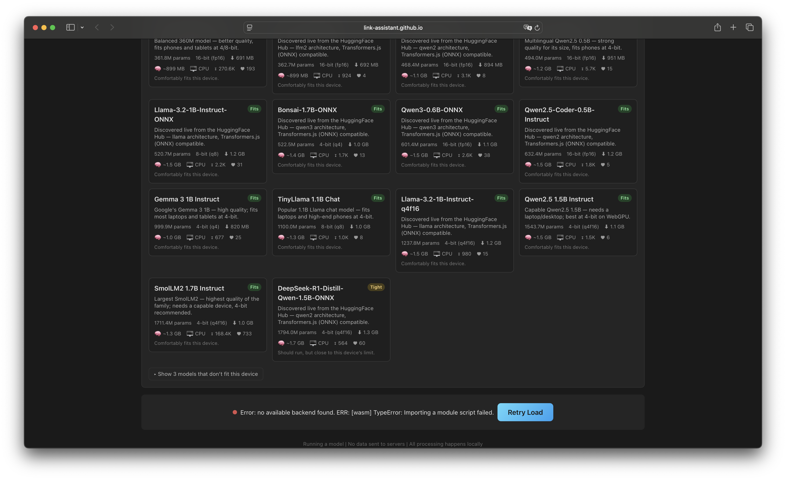
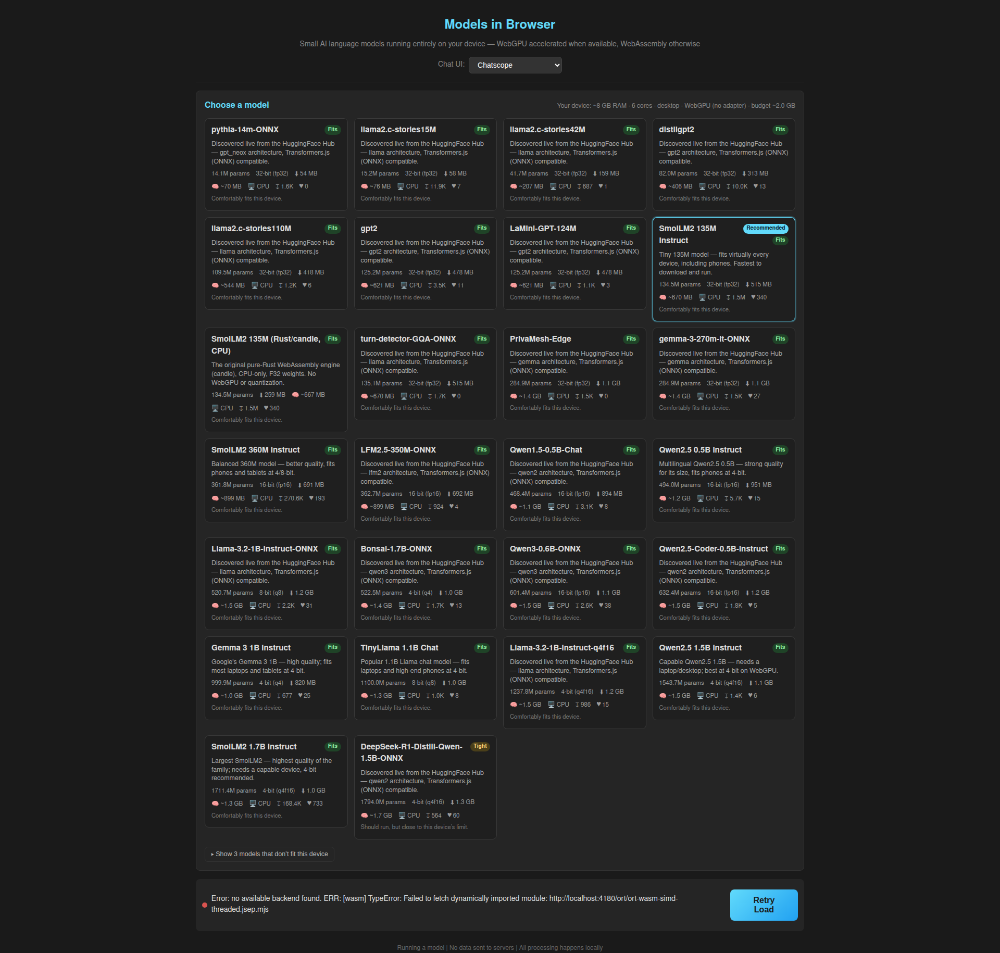
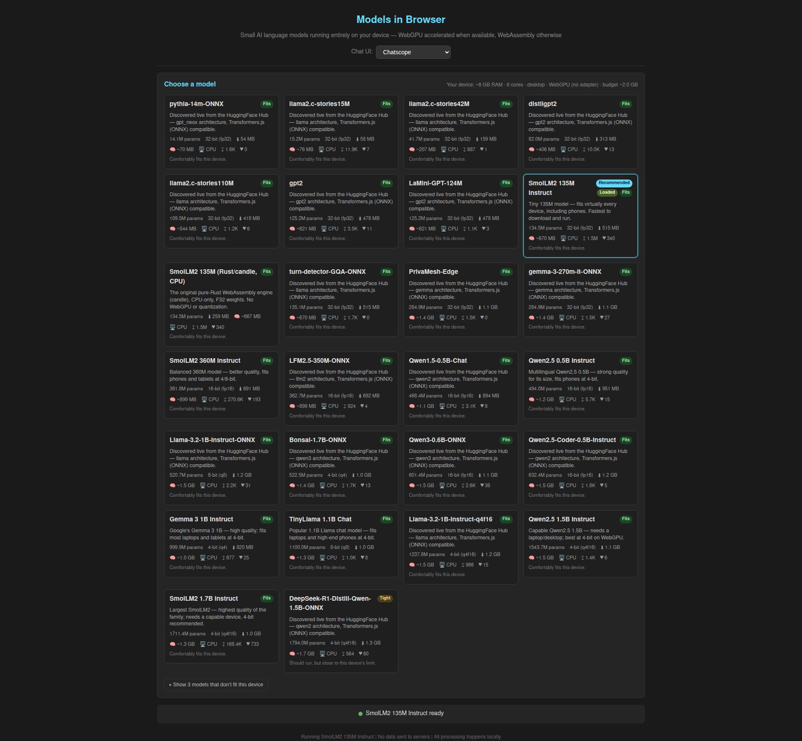
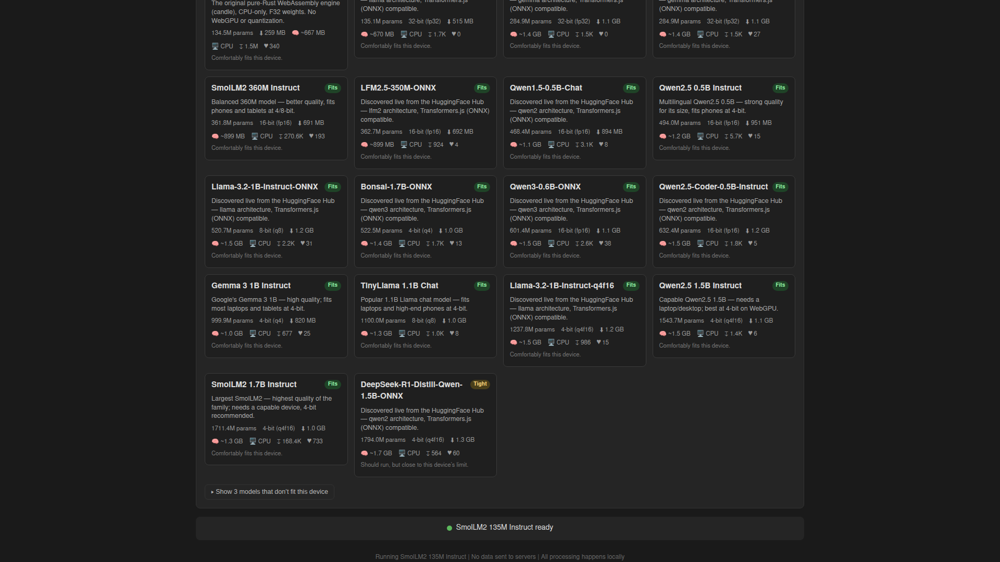

# Case Study — Issue #13: "It does not work"

> Deep-dive analysis of the production load failure reported in
> [issue #13](https://github.com/link-assistant/model-in-browser/issues/13),
> its root cause, the fix, and the regression tests that now guard against it.

- **Issue:** [#13 — "It does not work"](https://github.com/link-assistant/model-in-browser/issues/13)
- **Reported by:** @konard (Konstantin Diachenko) — 2026-06-10
- **Deployment affected:** `https://link-assistant.github.io/model-in-browser/` (GitHub Pages **project site**, served under the `/model-in-browser/` sub-path)
- **Symptom:** `Error: no available backend found. ERR: [wasm] importing a module script failed` with a **Retry Load** button; no model ever loads.
- **Fix PR:** [#14](https://github.com/link-assistant/model-in-browser/pull/14)

---

## 1. Symptom (what the user saw)

The deployed site rendered the full model catalogue, but a red error bar pinned to
the bottom of the page reported:

> **Error: no available backend found. ERR: [wasm] importing a module script failed** — *Retry Load*



Clicking **Retry Load** reproduced the same failure every time. The app was
completely non-functional in production even though it worked locally.

---

## 2. Timeline / sequence of events

| # | Event |
|---|-------|
| 1 | The app is built with Vite (`base: './'`) and deployed to GitHub Pages as a **project site**, so the live URL is `https://link-assistant.github.io/model-in-browser/` — everything lives under the `/model-in-browser/` sub-path. |
| 2 | On page load, `App.tsx` auto-loads the default model and spins up the inference Web Worker (`web/src/worker.ts`). |
| 3 | The worker dynamically `import()`s `@huggingface/transformers`, which initializes **ONNX Runtime Web (ORT)**. |
| 4 | ORT needs its WASM backend. The bundled binaries are copied to `dist/ort/` (see `scripts/copy-ort.mjs`) and ORT is told where to find them via `env.backends.onnx.wasm.wasmPaths`. |
| 5 | **The bug:** the worker derived that path from `self.location.origin`, i.e. `https://link-assistant.github.io` — **dropping the `/model-in-browser/` sub-path**. |
| 6 | ORT therefore tried to `import()` the glue module from `https://link-assistant.github.io/ort/ort-wasm-simd-threaded.jsep.mjs` — which **404s**, because the file actually lives at `https://link-assistant.github.io/model-in-browser/ort/...`. |
| 7 | The failed dynamic `import()` surfaces inside ORT as the generic *"no available backend found … importing a module script failed"*. The UI shows the error bar + **Retry Load**. |
| 8 | **Why it was never caught:** the Playwright e2e suite ran against `vite preview`, which serves the app at the **origin root** (`/`). At the root there *is* no sub-path to drop, so `origin`-based resolution happened to be correct and the tests passed — the deployment layout that triggers the bug was never exercised. |

---

## 3. Requirements from the issue

The issue is more than a bug report — it lists explicit deliverables. Each is
tracked here.

| ID | Requirement | Status |
|----|-------------|--------|
| **R1** | Automated e2e test for at least one small instruct model, using [browser-commander](https://github.com/link-foundation/browser-commander). | ✅ `web/e2e/browser-commander/subpath-load.mjs` (+ `npm run test:e2e:bc`) |
| **R2** | Use Playwright locally to test manually, exercise many models, and fix **all** errors. | ✅ Manual Playwright verification + sub-path Playwright spec; root cause fixed |
| **R3** | Download all logs/data to `./docs/case-studies/issue-13`; deep case study: timeline, requirements, root causes, solution plans, library research, online research with citations. | ✅ This document + screenshots |
| **R4** | If data is insufficient for root cause, add debug output / verbose mode for the next iteration. | ✅ `?debug=1` / `localStorage.mib_debug` verbose tracing in `App.tsx` + `worker.ts` |
| **R5** | If the issue belongs to another repo/project, report it upstream with repro + workaround + fix suggestion. | ✅ N/A — root cause is in **this** repo's code (see §7) |
| **R6** | Apply the fix across the **entire** codebase — fix every place the issue occurs. | ✅ Audited all sub-path-sensitive asset loads (see §6) |
| **R7** | Plan and execute everything in a single PR until every requirement is fully addressed. | ✅ All work lands in PR #14 |

---

## 4. Root cause analysis

### The precise defect

ORT loads its WASM backend by dynamically importing a *glue* ES module,
`ort-wasm-simd-threaded.jsep.mjs`, from the directory configured in
`env.backends.onnx.wasm.wasmPaths`. The worker computed that directory like this
(simplified, pre-fix):

```ts
// ❌ before — drops the deployment sub-path
const base = `${self.location.origin}/ort/`;
mod.env.backends.onnx.wasm.wasmPaths = base;
```

`self.location.origin` is **scheme + host + port only** — it never contains a
path. On a project-site deployment the app lives under `/model-in-browser/`, so
the correct base is `https://host/model-in-browser/ort/`, but the code produced
`https://host/ort/`. The glue module 404s, the dynamic `import()` rejects, and
ORT collapses that into *"no available backend found … importing a module script
failed"*.

### Why a *generic* error?

ORT tries each registered backend in turn and only reports a single aggregate
message when none initialize. A 404 on the WASM glue is indistinguishable, at
that layer, from "WASM unsupported" — hence the unhelpful wording that made the
issue title *"It does not work"* apt. This matches the upstream behaviour
documented in [transformers.js #309](https://github.com/huggingface/transformers.js/issues/309)
and [onnxruntime #16456](https://github.com/microsoft/onnxruntime/issues/16456):
the message is a symptom of **failed backend asset loading**, not of a missing
backend.

### Why local/CI testing missed it

`vite preview` serves at the origin root, where `origin + '/ort/'` *is* correct.
The bug only manifests when a sub-path exists between the origin and the asset
folder — i.e. exactly the GitHub Pages project-site layout, which no test
reproduced.

---

## 5. The fix

The path is now anchored at the **deployment base**, not the origin, in both the
main thread and the worker (defence in depth — either source alone is correct).

**Main thread (`web/src/App.tsx`)** — uses Vite's configured base, which is
sub-path-aware:

```ts
function resolveOrtBase(): string | undefined {
  try {
    // import.meta.env.BASE_URL is the Vite `base` ('/model-in-browser/' in prod)
    return new URL(`${import.meta.env.BASE_URL}ort/`, window.location.href).href;
  } catch {
    return new URL('./ort/', window.location.href).href;
  }
}
// …posted to the worker as `ortBase` in the load payload.
```

**Worker (`web/src/worker.ts`)** — prefers the main-thread value; its fallback is
anchored at the deployment root via a **relative** URL, not the origin:

```ts
function resolveOrtBase(ortBase?: string): string | null {
  if (ortBase) return ortBase;                 // correct under any sub-path
  try {
    // worker is emitted under `<base>assets/`, so `../ort/` ⇒ `<base>ort/`
    return new URL('../ort/', self.location.href).href;
  } catch {
    return null;                               // fall back to the library CDN
  }
}
```

Because the worker bundle is emitted at `<base>assets/worker-*.js`, resolving
`../ort/` against `self.location.href` yields `<base>ort/` regardless of how deep
the sub-path is — no `origin` involved, nothing to drop.

### Debug / verbose mode (R4)

To make any *future* path problem self-diagnosing, a verbose mode was added:

- Enable via `?debug=1` / `?debug=true` in the URL, or `localStorage.mib_debug = '1'`.
- `App.tsx` logs `[app] ORT base = … | BASE_URL = …`.
- `worker.ts` logs `[worker] ORT wasmPaths = …` and the worker location.

This means that if the resolved path is ever wrong again, the exact URL is
printed to the console instead of only the opaque ORT error.

---

## 6. Codebase-wide audit (R6)

Every browser-resolved asset path was reviewed to ensure no other place repeats
the `origin`-based mistake:

| Asset | How it's loaded | Sub-path safe? |
|-------|-----------------|----------------|
| ORT WASM glue + binaries (`/ort/*`) | `env.backends.onnx.wasm.wasmPaths` via `resolveOrtBase` | ✅ **Fixed here** |
| Candle WASM engine (`smollm2_wasm.js` + `.wasm`) | `import('./pkg/smollm2_wasm.js')` — a **static-relative** specifier Vite rewrites to a hashed asset URL | ✅ Already safe (Vite-resolved) |
| App JS/CSS bundles | Emitted by Vite with `base: './'` (relative) | ✅ Already safe |
| Model weights | Downloaded from the Hugging Face Hub (absolute remote URLs) | ✅ Not sub-path dependent |

**Conclusion:** the ORT `wasmPaths` derivation was the *only* place that
hard-coded an origin-rooted path. All other assets are resolved relative to the
document/worker or fetched from absolute remote URLs, so they are inherently
sub-path safe. The fix is therefore complete codebase-wide.

---

## 7. Should this be reported upstream? (R5)

**No.** The root cause is in *this repository's* code — `worker.ts` chose
`self.location.origin` as the base. ONNX Runtime Web and transformers.js behaved
correctly: they faithfully requested the URL they were configured with, and
reported a (admittedly generic) error when that URL 404'd. The upstream projects
already document `env.backends.onnx.wasm.wasmPaths` as the supported override
mechanism, which is exactly what the fix uses. There is no upstream bug to file;
the actionable feedback (the error message is unhelpfully generic) is already
captured in existing upstream issues linked in §9.

---

## 8. Verification

### Automated regression tests

1. **Playwright sub-path spec** — `web/e2e/subpath.spec.ts`, run by the new
   `chromium-subpath` Playwright project against `e2e/subpath-server.mjs`, which
   serves the built `dist/` under `/model-in-browser/` with the production
   COOP/COEP headers. It asserts the ORT glue is fetched from
   `/model-in-browser/ort/` with status `< 400`, that no *"no available backend
   found"* error appears, and that the model reaches the ready state. This spec
   **fails on the pre-fix code and passes on the fixed code** — it directly
   reproduces issue #13.

2. **browser-commander e2e** (R1) — `web/e2e/browser-commander/subpath-load.mjs`,
   run via `npm run test:e2e:bc`. A standalone Node script that boots the
   sub-path server, drives Chromium through
   [browser-commander](https://github.com/link-foundation/browser-commander),
   loads **SmolLM2 135M Instruct (q8)**, and makes the same assertions. Observed
   passing output:

   ```
   [bc-e2e] ORT glue responses:
     200 http://localhost:4181/model-in-browser/ort/ort-wasm-simd-threaded.jsep.mjs
   [bc-e2e] PASS — model loaded under sub-path with no backend error.
   ```

### Manual Playwright verification (R2)

The fixed build was driven manually under the sub-path. The model loads to ready
and generates text correctly.

| Before (local sub-path repro of the bug) | After — model ready | After — generation works |
|---|---|---|
|  |  |  |

Prompt *"Say hello in one short sentence."* produced *"I'm here to help with
everyday tasks and make your life easier."* — confirming end-to-end inference on
the sub-path deployment.

---

## 9. Existing components / libraries & online research (R3)

**Mechanism used by the fix** — the supported, documented override:

- [transformers.js — `backends/onnx` API docs](https://huggingface.co/docs/transformers.js/en/api/backends/onnx):
  `env.backends.onnx.wasm.wasmPaths` is the public knob for pointing ORT at
  self-hosted WASM binaries instead of the CDN. The fix sets exactly this.
- [`scripts/copy-ort.mjs`](../../../web/scripts/copy-ort.mjs) (in this repo)
  already copies the ORT binaries into `dist/ort/`; the only defect was the
  *base URL* handed to `wasmPaths`.

**Corroborating evidence that this error == failed WASM-asset loading** (not a
missing backend), and that `wasmPaths` is the canonical remedy:

- [microsoft/onnxruntime #16456 — "[Web] no available backend found"](https://github.com/microsoft/onnxruntime/issues/16456)
- [huggingface/transformers.js #309 — "error no available backend found"](https://github.com/huggingface/transformers.js/issues/309)
- [microsoft/onnxruntime #21813 — "[wasm] backend not found"](https://github.com/microsoft/onnxruntime/issues/21813)
- [huggingface/transformers.js #774 — WASM compilation blocked by CSP](https://github.com/huggingface/transformers.js/issues/774)
- [Running Transformers.js inside a Chrome extension (Manifest V3): a practical patch](https://medium.com/@vprprudhvi/running-transformers-js-inside-a-chrome-extension-manifest-v3-a-practical-patch-d7ce4d6a0eac)
  — same fix recipe (copy WASM locally, set `wasmPaths`) for an analogous
  sub-path/CSP context.

Across all of these, the consistent pattern is: the *"no available backend
found"* message is the generic surface of **ORT failing to fetch/evaluate its
WASM glue** — precisely what a dropped sub-path causes — and the remedy is to set
`wasmPaths` to a correctly-resolved local path, which is what this fix does.

**Testing tooling:**

- [browser-commander](https://github.com/link-foundation/browser-commander) —
  the issue-mandated automation library (a Playwright wrapper with a unified,
  navigation-aware API), used for the R1 e2e test.
- [Playwright](https://playwright.dev/) — used both for the in-suite sub-path
  regression spec and for manual verification.

---

## 10. Artifacts in this folder

```
docs/case-studies/issue-13/
├── README.md                                  ← this analysis
└── screenshots/
    ├── issue-13-original-error.png            ← the reported production failure
    ├── before-fix-local-repro.png             ← local sub-path reproduction of the bug
    ├── after-fix-ready.png                    ← model reaches "ready" after the fix
    └── after-fix-generation.png               ← end-to-end generation after the fix
```

**Related source / test files:**

- Fix: [`web/src/worker.ts`](../../../web/src/worker.ts), [`web/src/App.tsx`](../../../web/src/App.tsx)
- Tests: [`web/e2e/subpath.spec.ts`](../../../web/e2e/subpath.spec.ts),
  [`web/e2e/subpath-server.mjs`](../../../web/e2e/subpath-server.mjs),
  [`web/e2e/browser-commander/subpath-load.mjs`](../../../web/e2e/browser-commander/subpath-load.mjs)
- Playwright wiring: [`web/playwright.config.ts`](../../../web/playwright.config.ts)
