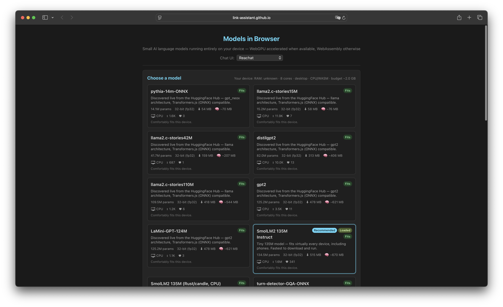
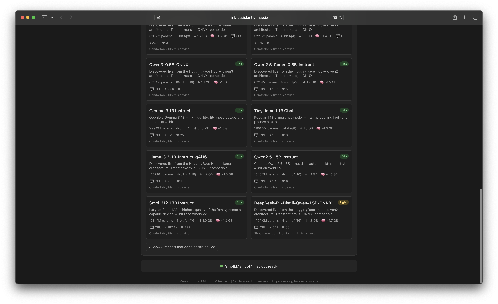
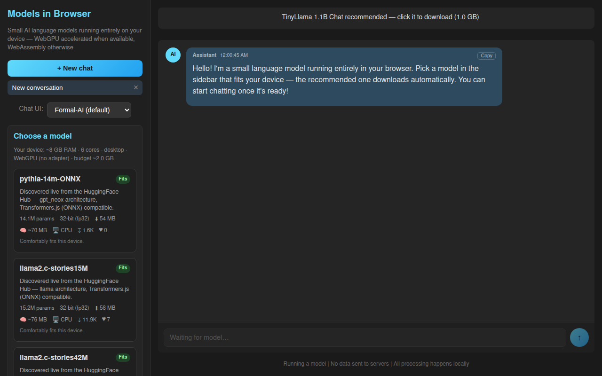
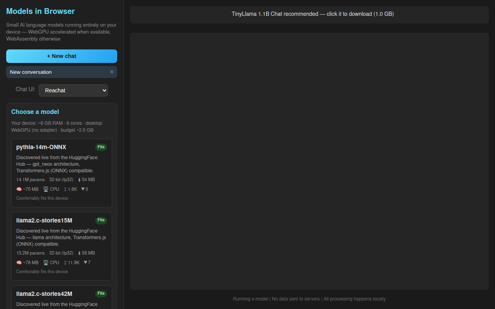

# Case Study — Issue #15: "Selecting chat and the model does nothing except from downloading model"

> Deep-dive analysis of the chat-unreachable failure reported in
> [issue #15](https://github.com/link-assistant/model-in-browser/issues/15),
> its root cause, the chat-first redesign that fixes it, and the regression
> tests that now guard against it.

- **Issue:** [#15 — "Selecting chat and the model does nothing except from downloading model"](https://github.com/link-assistant/model-in-browser/issues/15)
- **Reported by:** @konard (Konstantin Diachenko) — 2026-06-10
- **Deployment affected:** the web app (`web/`), served locally and at `https://link-assistant.github.io/model-in-browser/`
- **Symptom:** picking a chat engine + model only downloads the model; there is **no chat surface** to actually send a message. For the `reachat` engine the model selector additionally collapses to a narrow column.
- **Fix PR:** [#16](https://github.com/link-assistant/model-in-browser/pull/16)

---

## 1. Symptom (what the user saw)

The deployed app rendered a **full-page grid of model cards**. After choosing a
model, a status line at the bottom reported e.g. *"SmolLM2 135M Instruct ready"* —
but the catalogue grid filled the entire viewport, pushing any chat input and
message area off-screen. There was nowhere to type a message or read a reply.

| Reported state #1 | Reported state #2 |
|---|---|
|  |  |

In the user's words:

> So at the moment there is no way to actually chat with a model for some reason…

and separately:

> And for reachat for some reason width of model selector becomes narrow.

---

## 2. Timeline / sequence of events

| # | Event |
|---|-------|
| 1 | The app was built **catalogue-first**: `App.tsx` rendered the device-aware `ModelSelector` as a full-width grid at the top of a single-column layout. |
| 2 | The chat surface (`ChatContainer` + the active provider) was rendered *below* the catalogue in the same single column. |
| 3 | The model catalogue lists ~18 models, each a sizeable card. On a normal viewport the grid is tall enough to consume the whole screen. |
| 4 | **The bug (R1):** with the catalogue occupying the viewport, the chat composer and message list scrolled out of view. A user who picked a model saw the download complete but had no visible way to chat — "selecting the model does nothing except downloading." |
| 5 | **The reachat bug (R7):** because chat and catalogue shared one column, the `reachat` engine's Tailwind flex layout stretched horizontally and squeezed the neighbouring model selector into a narrow strip. |
| 6 | **Why it was never caught:** the e2e suite asserted the catalogue rendered and a model loaded, but never asserted that a composer was *visible at the same time* as the catalogue, nor that switching engines preserved the selector's width. |

---

## 3. Requirements from the issue

The issue is a bug report *and* a feature specification. Each explicit
requirement is tracked here.

| ID | Requirement | Status |
|----|-------------|--------|
| **R1** | Fix the core bug — there must be a way to actually chat with a model, not just download it. | ✅ Three-panel, chat-first layout — the composer is always visible beside the catalogue (`web/src/App.tsx`, `web/src/index.css`) |
| **R2** | By default, use the UI/UX of chat from [formal-ai](https://github.com/link-assistant/formal-ai). | ✅ `FormalAiProvider` is the default engine — avatars, per-message copy, markdown, auto-growing composer (`web/src/components/chat-providers/FormalAiProvider.tsx`) |
| **R3** | All chat engines from [react-chat-ui](https://github.com/link-assistant/react-chat-ui) should be selectable. | ✅ 6 engines wired into the selector: formal-ai, chatscope, deep-chat, react-chat-elements, assistant-ui, reachat (`web/src/types/chat.ts`, `web/src/components/chat-providers/`) |
| **R4** | All message/input features as in formal-ai; conversations panel; data stored in the browser; export/import. | ✅ Conversations sidebar; `localStorage` persistence; `.lino` export/import (`web/src/storage/conversations.ts`, `web/src/App.tsx`) |
| **R5** | Use Links Notation for all data storage, as in the formal-ai web UI. | ✅ Conversations serialized to a `model_in_browser_bundle` Links Notation document (`web/src/storage/links-notation.ts`, `conversations.ts`) |
| **R6** | An e2e test guaranteeing we can send a message and get a response. | ✅ `web/e2e/inference.spec.ts` (real model send→streamed reply) + `web/e2e/chat-ux.spec.ts` (shell/storage/engines) |
| **R7** | Fix the narrow model selector for reachat. | ✅ Selector lives in its own sidebar column; defensive CSS on the reachat container (`web/src/index.css`) |
| **R8** | Compile data to `./docs/case-studies/issue-15`; deep case study with timeline, all requirements, solution plans, library/online research. | ✅ This document + screenshots |
| **R9** | Plan and execute everything in a single PR until every requirement is fully addressed. | ✅ All work lands in PR #16 |

---

## 4. Root cause analysis

The bug was **layout**, not inference. The engine already loaded models and
generated text (issues #5, #7, #13 fixed earlier); the problem was that the user
could never *reach* the chat surface.

The pre-fix `App.tsx` rendered a single vertical column:

```
┌──────────────────────────────────────────────┐
│  Header                                        │
│  ┌──────────────────────────────────────────┐ │
│  │  ModelSelector — FULL-WIDTH GRID          │ │  ← ~18 cards,
│  │  [card][card][card][card][card][card] …   │ │     fills the viewport
│  │  [card][card][card][card][card][card] …   │ │
│  └──────────────────────────────────────────┘ │
│  … chat surface lives down here, off-screen …  │  ← never visible
└──────────────────────────────────────────────┘
```

Two consequences followed directly:

1. **R1 — chat unreachable.** The catalogue grid is taller than the viewport, so
   the chat composer below it is scrolled out of view. Selecting a model only
   surfaced a status string; there was no visible input.
2. **R7 — narrow selector.** Because the catalogue and the active chat engine
   shared one column, the `reachat` provider's horizontal Tailwind flex layout
   stole width from its sibling, collapsing the model selector.

Both are solved by the *same* structural change: split the screen into a fixed
sidebar (catalogue + conversations + data controls) and an always-present chat
column.

---

## 5. The fix

### 5.1 Chat-first three-panel layout (R1, R2, R7)

`App.tsx` now renders an `.app-shell` flex row:

```
┌──────────────┬───────────────────────────────────────┐
│  SIDEBAR     │  CHAT (always visible)                 │
│  320px       │                                        │
│  ┌────────┐  │  status / progress bar                 │
│  │ brand  │  │  ┌──────────────────────────────────┐  │
│  │ + New  │  │  │  message list (active conversa-  │  │
│  │ chat   │  │  │  tion) — greeting, user, AI …    │  │
│  ├────────┤  │  │                                  │  │
│  │ convos │  │  └──────────────────────────────────┘  │
│  ├────────┤  │  ┌──────────────────────────────────┐  │
│  │ engine │  │  │  composer (Enter to send)        │  │
│  │ picker │  │  └──────────────────────────────────┘  │
│  ├────────┤  │  "No data sent to servers"             │
│  │ model  │  │                                        │
│  │ catalog│  │                                        │
│  ├────────┤  │                                        │
│  │ export │  │                                        │
│  │ import │  │                                        │
│  └────────┘  │                                        │
└──────────────┴───────────────────────────────────────┘
```

- The model catalogue is confined to a scrollable `flex: 0 0 320px` sidebar
  (`.sidebar` in `index.css`), its grid forced to a single column
  (`.sidebar .model-list { grid-template-columns: 1fr }`).
- The chat column (`.chat-main`, `flex: 1 1 auto; min-width: 0`) always renders
  the status bar, the active provider, and the composer — so a model selection
  can never push chat off-screen again.
- **R7:** the selector now lives in its own column, structurally immune to the
  chat engine's width. Defensive CSS (`.reachat-container { width: 100%;
  min-width: 0 }` and `.chat-main { min-width: 0 }`) keeps any flex child from
  overflowing.

### 5.2 Formal-AI default chat UX (R2)

`FormalAiProvider` is the dependency-free default engine, mirroring the formal-ai
web app: per-message avatars, a copy button, markdown + code rendering, a
"Thinking…" typing indicator, and an auto-growing composer (Enter to send,
Shift+Enter for a newline). The app is wrapped in
`<ChatProviderProvider defaultProvider="formal-ai">`.

### 5.3 All engines selectable (R3)

Six providers are registered in `web/src/types/chat.ts` and surfaced through the
sidebar `ChatProviderSelector`: **formal-ai** (default), **chatscope**
(`@chatscope/chat-ui-kit-react`), **deep-chat** (`deep-chat-react`),
**react-chat-elements**, **assistant-ui** (`@assistant-ui/react`), and
**reachat**. This covers every engine that ships as a live, installable demo in
[react-chat-ui](https://github.com/link-assistant/react-chat-ui).

### 5.4 Links Notation storage + conversations + export/import (R4, R5)

Conversations are persisted to `localStorage` (key `mib_conversations_lino`) as a
Links Notation document, exactly as the formal-ai web UI stores its memory:

```lino
model_in_browser_bundle
  version "1"
  exported_at "2026-06-10T00:00:00.000Z"
  conversation "conv_…"
    title "Imported greeting"
    createdAt "…"
    updatedAt "…"
    message "m1"
      role "user"
      content "Imported greeting"
      sentAt "…"
    message "m2"
      role "assistant"
      content "Hi there"
      sentAt "…"
```

- `web/src/storage/links-notation.ts` — a small, indentation-based (2 spaces /
  level) Links Notation reader/writer.
- `web/src/storage/conversations.ts` — `serializeBundle` / `parseBundle`
  (forgiving), `saveConversations` / `loadConversations`, and `deriveTitle`.
- The sidebar **Export** button downloads `model-in-browser-chats.lino`; **Import**
  reads a `.lino` bundle and restores the conversation list — mirroring
  formal-ai's `formal-ai-memory.lino` / `formal_ai_bundle` flow.

---

## 6. Codebase-wide audit

| Surface | Pre-fix | Post-fix |
|---|---|---|
| Layout (`App.tsx`) | Single column, catalogue-first | Three-panel shell; chat always visible |
| Catalogue width (`ModelSelector`) | Full-width grid | Single-column, confined to 320px sidebar |
| `reachat` selector width (R7) | Squeezed by shared column | Isolated column + defensive CSS |
| Chat storage | In-memory only (lost on reload) | Links Notation in `localStorage`; export/import |
| Engines | Selectable but chat unreachable | All 6 selectable *and* reachable |
| e2e coverage | Asserted model load only | Asserts composer visibility, engine widths, storage round-trips, and real send→reply |

**Conclusion:** the chat-unreachable defect was rooted entirely in the
single-column layout. Splitting the shell fixes both R1 and R7 at the structural
level; the storage and engine work fulfils R2–R5. No other surface rendered chat,
so the fix is complete codebase-wide.

---

## 7. Should this be reported upstream? (R5/R7)

**No.** The root cause is in *this repository's* layout — the catalogue-first
single column and the shared chat/catalogue column. The wrapped libraries
(formal-ai's UX, react-chat-ui's engines, reachat) behaved correctly in
isolation; the narrow-selector symptom was a consequence of *our* layout placing
a horizontally-greedy flex engine beside the selector, not a bug in reachat. The
remedy is purely local CSS/structure. There is no upstream bug to file.

---

## 8. Verification

### Automated regression tests

1. **`web/e2e/chat-ux.spec.ts`** (6 tests, fast — no model download):
   - *keeps the chat surface reachable beside the model catalog* — asserts the
     sidebar, model selector, own-chat panel, and composer are **all visible at
     once** (the direct R1 regression guard).
   - *all chat engines are selectable and never narrow the model selector
     (R3, R7)* — iterates all six engines, asserting the chat column renders and
     the model selector keeps `boundingBox().width > 250` for every engine
     (including reachat).
   - *creates, switches, and deletes conversations*.
   - *persists conversations across reloads (Links Notation storage, R4/R5)* —
     checks `localStorage['mib_conversations_lino']` contains the
     `model_in_browser_bundle` root and survives a reload.
   - *exports conversations as a .lino bundle (R4)*.
   - *imports conversations from a .lino bundle (R4)*.

2. **`web/e2e/inference.spec.ts`** (R6) — the send→response guarantee. Pins
   SmolLM2 135M Instruct (q8), auto-loads it, sends real messages, and asserts a
   streamed reply renders (`message-assistant` count grows; "Thinking…" appears
   then clears; no console errors). Observed:

   ```
   Running 6 tests using 2 workers
     6 passed (55.6s)
   ```

### Manual Playwright verification (R1, R7)

The fixed build was driven manually. The chat composer is visible beside the
catalogue, and switching to reachat keeps the model selector at full sidebar
width.

| After — default (formal-ai) chat-first layout | After — reachat keeps the selector full-width |
|---|---|
|  |  |

---

## 9. Existing components / libraries & online research (R8)

**Default chat UX — formal-ai:**

- [link-assistant/formal-ai](https://github.com/link-assistant/formal-ai) — the
  reference UX. Its README documents the storage model this fix mirrors: *"Every
  interface produces the same self-contained Links Notation document by
  default,"* with an **Export memory** button that writes
  `formal-ai-memory.lino` as a complete `formal_ai_bundle`, and an **Import
  memory** counterpart. We adopt the same pattern under
  `model_in_browser_bundle` / `model-in-browser-chats.lino`.

**Selectable engines — react-chat-ui:**

- [link-assistant/react-chat-ui](https://github.com/link-assistant/react-chat-ui)
  — catalogue of chat-UI engines. It ships **18 catalogue profiles**, of which
  **3 are live, installable demos** (ChatScope, React Chat Elements, Deep Chat);
  the remaining 15 are source-only blocks for packages that aren't installed or
  require hosted credentials. This fix wires every live engine plus
  assistant-ui and reachat into the selector.

**Wrapped chat libraries:**

- [@chatscope/chat-ui-kit-react](https://github.com/chatscope/chat-ui-kit-react)
  — classic chat components (ChatScope).
- [deep-chat / deep-chat-react](https://github.com/OvidijusParsiunas/deep-chat)
  — configurable AI chat web component; wrapped with a streaming bridge in
  `DeepChatProvider`.
- [react-chat-elements](https://github.com/Detaysoft/react-chat-elements) —
  lightweight chat components.
- [@assistant-ui/react](https://github.com/assistant-ui/assistant-ui) — modern
  AI chat interface with streaming.
- [reachat](https://github.com/reaviz/reachat) — Tailwind-styled, LLM-focused
  chat; the source of the R7 width symptom (its horizontal flex layout), fixed
  here at the layout level.

**Storage format — Links Notation:**

- Links Notation (`.lino`) — an indentation-based, human-readable symbolic
  format used by formal-ai for all chat/memory storage. Implemented locally in
  `web/src/storage/links-notation.ts` so the app has zero new runtime
  dependencies for persistence.

**Testing tooling:**

- [Playwright](https://playwright.dev/) — both the fast chat-UX shell spec and
  the model-loading inference spec.

---

## 10. Artifacts in this folder

```
docs/case-studies/issue-15/
├── README.md                              ← this analysis
└── screenshots/
    ├── issue-15-img1.png                  ← reported state: full-page catalogue, no chat
    ├── issue-15-img2.png                  ← reported state (second screenshot)
    ├── after-fix-default-layout.png       ← chat-first three-panel layout after the fix
    └── after-fix-reachat-width.png        ← reachat keeps the model selector full-width
```

**Related source / test files:**

- Layout & wiring: [`web/src/App.tsx`](../../../web/src/App.tsx),
  [`web/src/index.css`](../../../web/src/index.css)
- Default chat UX: [`web/src/components/chat-providers/FormalAiProvider.tsx`](../../../web/src/components/chat-providers/FormalAiProvider.tsx)
- Engine registry: [`web/src/types/chat.ts`](../../../web/src/types/chat.ts),
  [`web/src/components/chat-providers/`](../../../web/src/components/chat-providers/)
- Links Notation storage: [`web/src/storage/links-notation.ts`](../../../web/src/storage/links-notation.ts),
  [`web/src/storage/conversations.ts`](../../../web/src/storage/conversations.ts)
- Tests: [`web/e2e/chat-ux.spec.ts`](../../../web/e2e/chat-ux.spec.ts),
  [`web/e2e/inference.spec.ts`](../../../web/e2e/inference.spec.ts),
  [`web/src/storage/storage.test.ts`](../../../web/src/storage/storage.test.ts)
